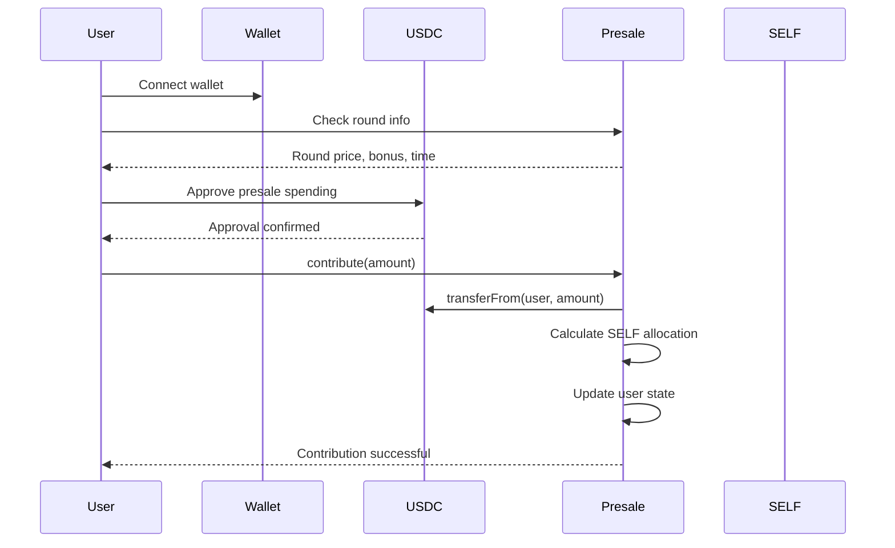
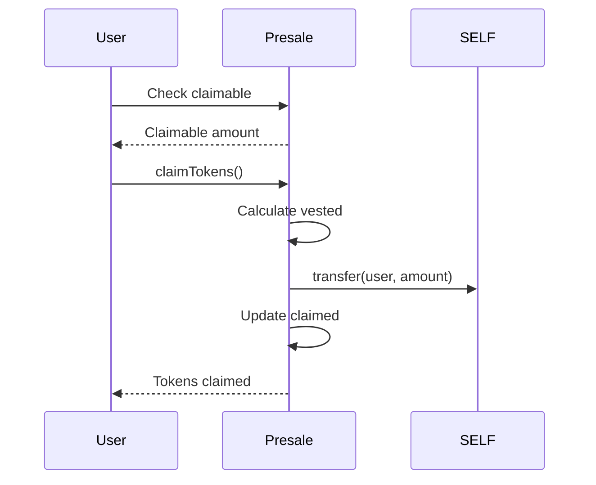
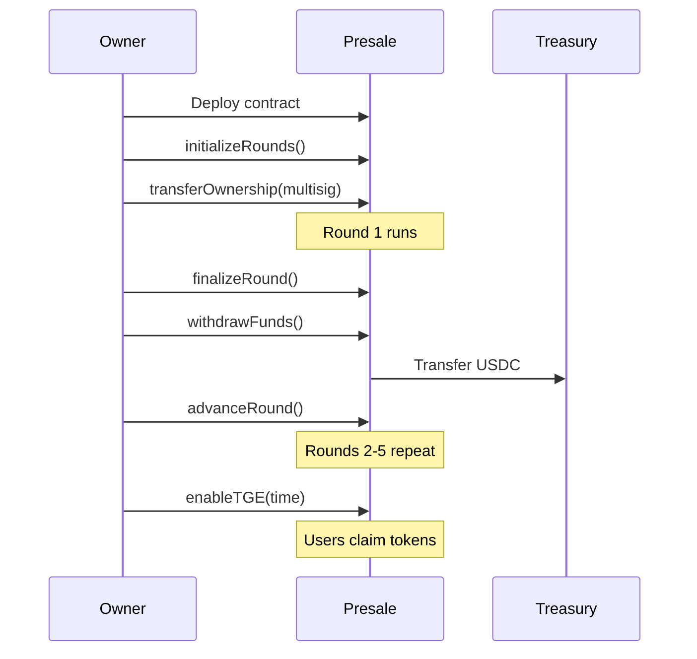

# SELF Token Presale - Architecture Documentation

**Version:** 1.0  
**Date:** December 14, 2025  
**Status:** Ready for Audit  

---

## System Overview

The SELF token presale is a multi-round fundraising mechanism deployed on Binance Smart Chain (BSC). It enables users to purchase SELF tokens using USDC across 5 rounds with progressively higher prices and lower bonuses over a 40-day period.

### Key Features

- **5-Round Dynamic Pricing:** 6¢ → 10¢
- **Declining Bonuses:** 15% → 3%
- **Variable TGE Unlocks:** 50% → 30%
- **Linear Vesting:** 10 months for locked portion
- **Target Raise:** $2.5M total
- **Timeline:** February 1 - March 12, 2026

---

## Smart Contract Architecture

### Contract Hierarchy

```
SELFPresale (Main Contract)
├── ReentrancyGuard (OpenZeppelin)
├── Pausable (OpenZeppelin)
└── Ownable (OpenZeppelin)

SELFToken (ERC20)
├── ERC20 (OpenZeppelin)
└── Ownable (OpenZeppelin)

External Dependencies:
├── IERC20 (USDC on BSC)
└── SafeERC20 (OpenZeppelin)
```

### State Variables

**Immutable:**
```solidity
IERC20 public immutable USDC;  // BSC USDC address
IERC20 public immutable SELF;  // SELF token address
```

**Configuration:**
```solidity
uint256 public constant MIN_CONTRIBUTION = 100 * 1e18;   // $100
uint256 public constant MAX_CONTRIBUTION = 10_000 * 1e18; // $10,000
uint256 public constant VESTING_DURATION = 10 * 30 days;  // 10 months
```

**Round State:**
```solidity
struct Round {
    uint256 price;       // USDC per SELF (18 decimals)
    uint256 target;      // Target USDC raise
    uint256 raised;      // Current amount raised
    uint256 startTime;   // Unix timestamp
    uint256 endTime;     // Unix timestamp
    uint8 tgeUnlock;     // TGE unlock percentage
    uint8 bonus;         // Bonus percentage
    bool finalized;      // Finalization status
}

Round[5] public rounds;
uint256 public currentRound;
bool public roundsInitialized;
```

**User State:**
```solidity
struct UserContribution {
    uint256 totalUSDC;        // Total USDC contributed
    uint256 totalSELF;        // Total SELF allocated
    uint256 totalBonus;       // Total bonus tokens
    uint256 tgeUnlockAmount;  // Unlockable at TGE
    uint256 vestedAmount;     // Linearly vested amount
    uint256 claimed;          // Already claimed tokens
}

mapping(address => UserContribution) public contributions;
mapping(address => mapping(uint256 => uint256)) public contributionsByRound;
```

**Global Stats:**
```solidity
uint256 public totalParticipants;
uint256 public totalRaised;
uint256 public tgeTime;
bool public tgeEnabled;
```

---

## Function Reference

### User Functions

#### `contribute(uint256 usdcAmount)`

**Description:** Contribute USDC to the active round

**Access:** Public (when not paused)

**Parameters:**
- `usdcAmount` - Amount of USDC (18 decimals)

**Requirements:**
- Rounds initialized
- Round active (within time bounds)
- Round not finalized
- Amount >= MIN_CONTRIBUTION
- User total <= MAX_CONTRIBUTION
- Round capacity not exceeded

**Process:**
1. Validate amount and round state
2. Calculate SELF allocation based on round price
3. Calculate bonus tokens
4. Determine TGE unlock vs vested
5. Transfer USDC from user
6. Update user contribution state
7. Update round and global state
8. Emit Contribution event
9. Auto-finalize if target reached

**Events:**
```solidity
emit Contribution(user, round, usdcAmount, selfAmount, bonusAmount);
emit RoundFinalized(round, totalRaised);  // If target hit
```

#### `claimTokens()`

**Description:** Claim available SELF tokens after TGE

**Access:** Public

**Requirements:**
- TGE enabled
- Current time >= TGE time
- User has allocation
- Claimable amount > 0

**Process:**
1. Calculate claimable amount (TGE unlock + vested)
2. Update claimed amount
3. Transfer SELF to user
4. Emit TokensClaimed event

**Vesting Calculation:**
```solidity
if (timeElapsed >= VESTING_DURATION) {
    // Fully vested
    unlocked = tgeUnlock + vestedAmount;
} else {
    // Partial vesting (linear)
    vestedUnlocked = (vestedAmount * timeElapsed) / VESTING_DURATION;
    unlocked = tgeUnlock + vestedUnlocked;
}
claimable = unlocked - claimed;
```

#### `getClaimableAmount(address user)`

**Description:** View function to check claimable tokens

**Access:** Public view

**Returns:** uint256 - Claimable SELF amount

### Admin Functions (Owner Only)

#### `initializeRounds(uint256[5] startTimes, uint256[5] endTimes)`

**Description:** Initialize the 5 rounds with start/end times

**Access:** Owner only, once

**Parameters:**
- `startTimes` - Array of 5 start timestamps
- `endTimes` - Array of 5 end timestamps

**Sets:**
- Round 1: 6¢, $1.5M, 50% TGE, 15% bonus
- Round 2: 7¢, $500k, 45% TGE, 12% bonus
- Round 3: 8¢, $250k, 40% TGE, 9% bonus
- Round 4: 9¢, $150k, 35% TGE, 6% bonus
- Round 5: 10¢, $100k, 30% TGE, 3% bonus

#### `finalizeRound()`

**Description:** Manually finalize current round

**Access:** Owner only

**Requirements:**
- Round active
- Time expired OR target reached

#### `advanceRound()`

**Description:** Move to next round

**Access:** Owner only

**Requirements:**
- Current round < 4
- Current round finalized

#### `enableTGE(uint256 _tgeTime)`

**Description:** Enable TGE and set claiming time

**Access:** Owner only, once

**Requirements:**
- All rounds finalized
- TGE time >= current time

#### `withdrawFunds()`

**Description:** Withdraw raised USDC to owner

**Access:** Owner only

**Transfers:** All USDC balance to owner address

#### `emergencyWithdrawSELF()`

**Description:** Emergency withdrawal of SELF tokens

**Access:** Owner only

**Requirements:**
- TGE not enabled (presale cancelled scenario)

#### `pause() / unpause()`

**Description:** Emergency pause/unpause contributions

**Access:** Owner only

#### `transferOwnership(address newOwner)`

**Description:** Transfer contract ownership (inherited from Ownable)

**Access:** Owner only

---

## User Journey Flows

### Contribution Flow



### Claiming Flow



### Admin Flow



---

## Token Allocation Mathematics

### Example: $1,000 Contribution in Round 1

**Given:**
- Contribution: 1,000 USDC
- Price: 0.06 USDC per SELF
- Bonus: 15%
- TGE Unlock: 50%

**Calculations:**
```
Base Allocation = 1000 / 0.06 = 16,666.67 SELF
Bonus Amount = 16,666.67 * 0.15 = 2,500 SELF
Total SELF = 16,666.67 + 2,500 = 19,166.67 SELF

TGE Unlock = (16,666.67 * 0.50) + 2,500 = 10,833.34 SELF
Vested = 16,666.67 * 0.50 = 8,333.34 SELF

At TGE: Claim 10,833.34 SELF
After 5 months: Claim 10,833.34 + (8,333.34 * 0.5) = 14,999.97 SELF
After 10 months: Claim all 19,166.67 SELF
```

### Cross-Round Comparison

| Metric | Round 1 | Round 2 | Round 3 | Round 4 | Round 5 |
|--------|---------|---------|---------|---------|---------|
| Price | 6¢ | 7¢ | 8¢ | 9¢ | 10¢ |
| Base (1k) | 16,667 | 14,286 | 12,500 | 11,111 | 10,000 |
| Bonus | 15% | 12% | 9% | 6% | 3% |
| Bonus Amt | 2,500 | 1,714 | 1,125 | 667 | 300 |
| Total SELF | 19,167 | 16,000 | 13,625 | 11,778 | 10,300 |
| TGE Unlock | 10,833 | 8,143 | 6,125 | 4,556 | 3,300 |
| Vested | 8,334 | 7,143 | 6,250 | 5,556 | 5,000 |

---

## Security Model

### Trust Assumptions

**User Trust:**
- Contract logic is correct (verified by audit)
- Owner acts in good faith
- USDC contract is legitimate BSC USDC

**Owner Trust:**
- Users provide valid USDC
- No malicious token contracts

### Attack Surface

**External Calls:**
1. `USDC.transferFrom()` - User to contract
2. `USDC.transfer()` - Contract to owner (withdrawal)
3. `SELF.transfer()` - Contract to user (claiming)

**All protected by:**
- SafeERC20 library
- ReentrancyGuard modifier
- Checks-Effects-Interactions pattern

### Access Control Matrix

| Function | User | Owner | Anyone (View) |
|----------|------|-------|---------------|
| contribute | ✅ | ✅ | ❌ |
| claimTokens | ✅ | ✅ | ❌ |
| getClaimableAmount | ✅ | ✅ | ✅ |
| getCurrentRound | ✅ | ✅ | ✅ |
| getUserContribution | ✅ | ✅ | ✅ |
| initializeRounds | ❌ | ✅ | ❌ |
| finalizeRound | ❌ | ✅ | ❌ |
| advanceRound | ❌ | ✅ | ❌ |
| enableTGE | ❌ | ✅ | ❌ |
| withdrawFunds | ❌ | ✅ | ❌ |
| pause/unpause | ❌ | ✅ | ❌ |

---

## Gas Optimization Notes

**Efficient Patterns:**
- Immutable variables for tokens
- Constants for fixed parameters
- Minimal storage updates per transaction
- No unbounded loops in user functions

**Typical Gas Costs (Estimated):**
- First contribution: ~150k gas
- Subsequent contributions: ~100k gas
- Claiming tokens: ~70k gas
- Admin functions: ~50k-80k gas

---

## Deployment Checklist

### Pre-Deployment

- [ ] Audit complete and all issues resolved
- [ ] Test suite passes 100%
- [ ] Contracts compiled with optimization
- [ ] Round start/end times calculated
- [ ] Multi-sig wallet prepared
- [ ] SELF tokens minted (500M)

### Deployment

- [ ] Deploy SELFToken to BSC
- [ ] Verify on BscScan
- [ ] Deploy SELFPresale with USDC + SELF addresses
- [ ] Verify on BscScan
- [ ] Transfer 42M SELF to presale contract
- [ ] Initialize rounds with correct timestamps
- [ ] Transfer ownership to multi-sig
- [ ] Test contribution on mainnet (small amount)

### Post-Deployment

- [ ] Announce contract addresses
- [ ] Update frontend configuration
- [ ] Monitor first contributions
- [ ] Set up alerts/monitoring
- [ ] Prepare withdrawal strategy

---

## Monitoring & Maintenance

### Events to Monitor

```solidity
event Contribution(address indexed user, uint256 indexed round, 
                   uint256 usdcAmount, uint256 selfAmount, uint256 bonusAmount);
event RoundFinalized(uint256 indexed round, uint256 totalRaised);
event RoundAdvanced(uint256 indexed newRound);
event TGEEnabled(uint256 tgeTime);
event TokensClaimed(address indexed user, uint256 amount);
```

### Key Metrics

- Total raised per round
- Number of participants
- Average contribution size
- Time to reach targets
- Claim rate after TGE
- Vesting claim patterns

### Admin Actions Required

**During Presale:**
- Monitor round progress
- Finalize rounds when time expires
- Advance to next round
- Withdraw funds periodically

**Post-Presale:**
- Enable TGE at appropriate time
- Monitor claiming
- Support user questions

---

## Emergency Procedures

### Pause Scenario

**When to pause:**
- Critical bug discovered
- Unusual activity detected
- Oracle manipulation (N/A - no oracles)
- External contract compromise

**Actions:**
1. Call `pause()` immediately
2. Investigate issue
3. Communicate with community
4. Implement fix if needed
5. Resume with `unpause()` or refund

### Refund Scenario

**If presale must be cancelled:**
1. Do NOT enable TGE
2. Call `emergencyWithdrawSELF()` to recover SELF
3. Manual USDC refunds to contributors
4. Communicate transparent ly with community

---

**Document Version:** 1.0  
**Last Updated:** December 13, 2024  
**Next Review:** Post-audit

